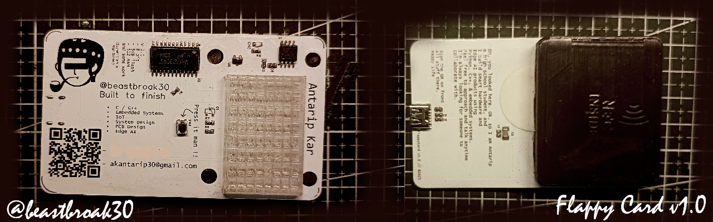

  

#  Hello! This is Antarip Here.

I am a student but loves to call hinself— Embedded System Engineer and IoT Developer with work in hardware development, baremetal, RTOS and Edge AI.
Welcome to my page; on my Github, you can find:

- Projects created by me
- Baremetal, RTOS and low-level programming implementations
- IoT, hardware and Edge AI solutions
- AI/ML Projects
  
#### 📧 Where you can find me
 

*I am open to new opportunities.*

#### 📜 Github stats:

 
 

---
### I am a student that wants to do full time embedded system creations 

In my view, the best approach is to pick the tech that's just right for the problem.
Additionally, I enjoy expanding my knowledge, and because of that, I am open to learning new technologies and languages 🐱‍👓

### My current technology stack:
         

### Tech that I am using but less 
     
--- 

#### In the meantime, I research about the next system that could help Edge AI become more powerful.
-  In review of paper RSSI-based Human Sensing research with 94% accuracy.
- Working on KANRE (Embedded system solutions).
- Love to Play Lawn Tennis & Kho-Kho.
- **If you have seen the above image, that is actually a card that plays flappy bird [Demo Here](assets/readmecard.md)**

#### List of Honors
- International Scholarship: Selected for the [Natsuyasumi Project '26](https://www.natsuproject.org/) in Tokyo, Japan, as an Independent Researcher.
- IIT Bombay Meshmerize Champion: Ranked 1st Place at the zonal level, competing as the only school team against 38 college-level teams.
- Scientific Publication: Authored and submitted a peer-reviewed manuscript on RSSI-based Human Presence Estimation to the Internet of Things and Cyber-Physical Systems journal.
